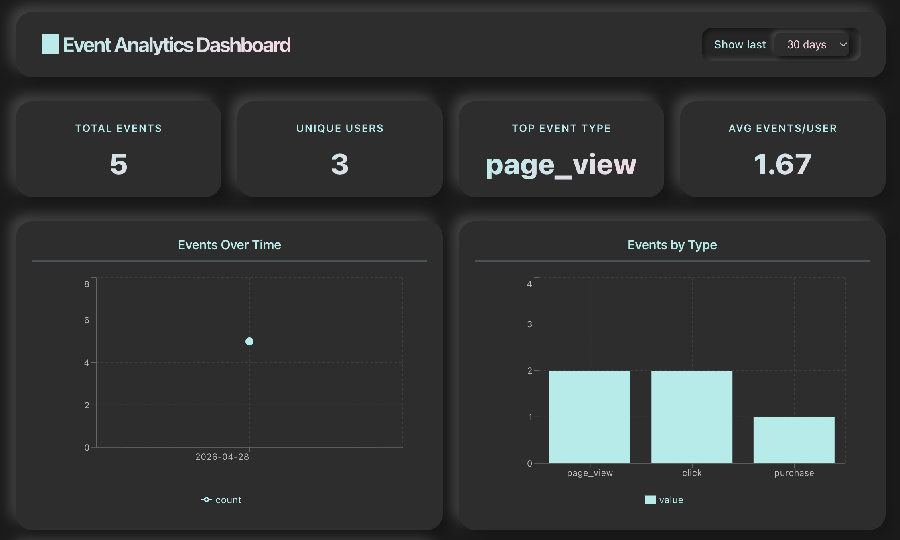

# 📊 Event Analytics Dashboard

A real-time event collection and analytics dashboard with a dark neumorphism design, built with TypeScript, React, and Express.

## What It Does

This dashboard provides real-time event analytics by:
- **Collecting** user events (clicks, page views, purchases) via a REST API
- **Tracking** key metrics like total events, unique users, and event types
- **Visualizing** data through interactive line, bar, and pie charts
- **Updating** in real-time every 10 seconds
- **Simulating** events to test the system

## Features

- **Real-time event collection** - Send events via REST API
- **Interactive analytics** - Line chart, bar chart, and pastel pie chart
- **Dark neumorphism UI** - Modern 3D-inspired design with gradient accents
- **Auto-refresh** - Dashboard updates every 10 seconds
- **Event simulator** - Test events in real-time
- **Responsive design** - Works on desktop, tablet, and mobile
- **Date filtering** - View data for 1, 7, 30, or 90 days

## Tech Stack

- **Frontend:** React 19, TypeScript, Vite, Recharts
- **Backend:** Node.js, Express, TypeScript
- **Styling:** CSS3 with Neumorphism design
- **HTTP Client:** Axios